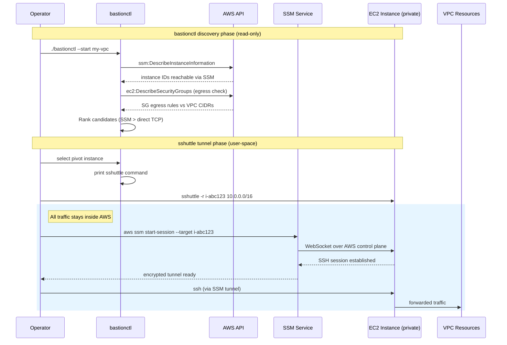
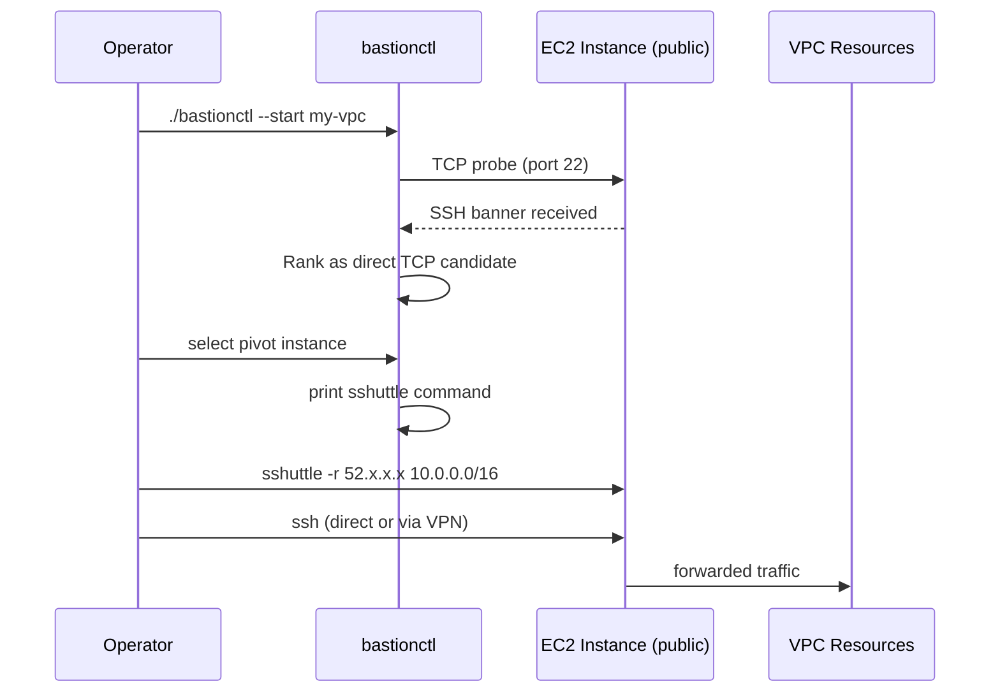

# bastionctl

Finds, tests, and remembers the best EC2 instance to use as an `sshuttle`
pivot into an AWS VPC.

## How it works

- Resolves AWS credentials via STS and lists saved connections per account.
- **New connection**: discovers VPCs, lists running instances, and checks
  reachability via SSM (`ssm:DescribeInstanceInformation`) and direct TCP.
- Each candidate's Security Group egress is checked against VPC CIDRs to
  verify it can route traffic — restricted egress candidates rank lower.
- You pick a candidate from an interactive menu, re-verify with a real
  `ssh` attempt, choose SSH user/key, and save as **VPC** or **Dedicated
  network** (custom routes from the instance's subnet route table).
- **Subsequent runs**: re-check the saved target and print, launch, or
  background the tunnel.

bastionctl hands off to your system's `sshuttle` binary — it does **not**
reimplement sshuttle's tunneling. Run the printed command as your normal
user; `sshuttle` elevates its firewall helper when needed.

## Connection architecture

### SSM-brokered connection (no public IP required)



**Why this is secure:**

- **No inbound ports open** — the EC2 instance needs no public IP, no SSH
  port in its Security Group. SSM uses the outbound AWS management
  channel (443) that every SSM-managed instance already has.
- **AWS-authenticated only** — `aws ssm start-session` requires valid IAM
  credentials with `ssm:StartSession` permission. No SSH keys are
  exposed over the network.
- **Private network path** — traffic from your machine to the VPC never
  traverses the public internet. The SSM tunnel is end-to-end encrypted
  via the AWS control plane.
- **No credential storage** — bastionctl never stores or transmits SSH
  keys. It relies on your existing `~/.ssh/config` and `ssh-agent`.
- **bastionctl is read-only** — it only calls `Describe*` APIs. The
  actual tunnel is established by `sshuttle` using your system's
  `ssh`, which inherits your SSH config (ProxyCommand for SSM, keys,
  agent).

### Direct TCP connection (public IP / VPN)



## Build

```bash
go mod tidy
go build -o bastionctl .
```

Cross-compile (no CGO, single static binaries):

```bash
GOOS=darwin  GOARCH=arm64 go build -o bin/bastionctl-darwin-arm64  .
GOOS=darwin  GOARCH=amd64 go build -o bin/bastionctl-darwin-amd64  .
GOOS=linux   GOARCH=amd64 go build -o bin/bastionctl-linux-amd64   .
GOOS=linux   GOARCH=arm64 go build -o bin/bastionctl-linux-arm64   .
```

## Usage

```bash
./bastionctl                          # first run: interactive discovery
./bastionctl --aws-profile prod       # use an AWS shared-config profile
./bastionctl --connection corp        # use/create a named connection
./bastionctl --vpc-id vpc-0abc123     # target a specific VPC
./bastionctl --region eu-central-1    # override region
./bastionctl --rescan corp            # refresh a saved connection
./bastionctl --forget corp            # delete one saved connection
./bastionctl --launch                 # run sshuttle in the foreground
./bastionctl --start corp             # start sshuttle in the background
./bastionctl --stop corp              # stop a background tunnel
./bastionctl --status corp            # show tunnel status
./bastionctl --logs                   # follow daemon logs live
```

`--start` uses sshuttle's native daemon mode (may ask for sudo). `--logs`
streams syslog history — on macOS it's system-wide; on Linux it uses
journald or `/var/log/syslog`. `--stop` validates the PID file before
sending SIGTERM.

Connections are stored per account:

```text
~/.config/bastionctl/accounts/<account-id>/<connection>.yaml
```

`$XDG_CONFIG_HOME` and `--config-dir` are supported. Interactive menus use
arrow keys (or `j`/`k`) and Enter; Space toggles a CIDR in the network
selector.

## IAM Permissions (read-only)

```
ec2:DescribeInstances
ec2:DescribeRegions
ec2:DescribeVpcs
ec2:DescribeSecurityGroups
ec2:DescribeRouteTables
ssm:DescribeInstanceInformation
sts:GetCallerIdentity
```

- `ec2:DescribeRouteTables` — dedicated network discovery; non-fatal if missing.
- `ec2:DescribeRegions` — region picker; falls back to profile region if missing.
- `iam:ListAccountAliases` — optional, shows alias in header.
- `ssm:DescribeInstanceInformation` — separate from `ssm:StartSession`; may need to be added.

## Prerequisites for SSM-brokered targets

- **Session Manager plugin** for the AWS CLI.
- A `~/.ssh/config` entry proxying through it:
  ```
  Host i-* mi-*
      ProxyCommand sh -c "aws ssm start-session --target %h --document-name AWS-StartSSHSession --parameters 'portNumber=%p'"
  ```
  bastionctl uses your existing `ssh` config — it never invokes
  `aws ssm start-session` directly.

## Known Limitations

- No caching/backoff tuning beyond AWS SDK defaults.
- SG-to-SG rule references and managed prefix lists are not resolved in
  the egress check.
- Bulk ranking never shells out to real `ssh`/`aws ssm start-session`;
  the real test runs once on your final selection.
- Dedicated-network discovery reads only the selected instance's subnet
  route table — add external ranges manually.
